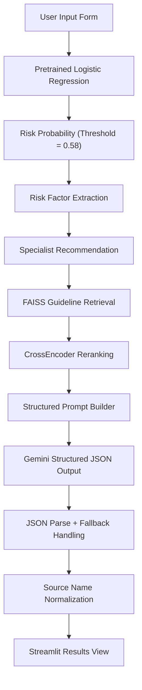
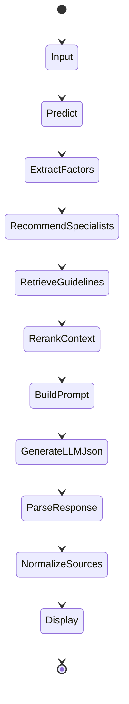
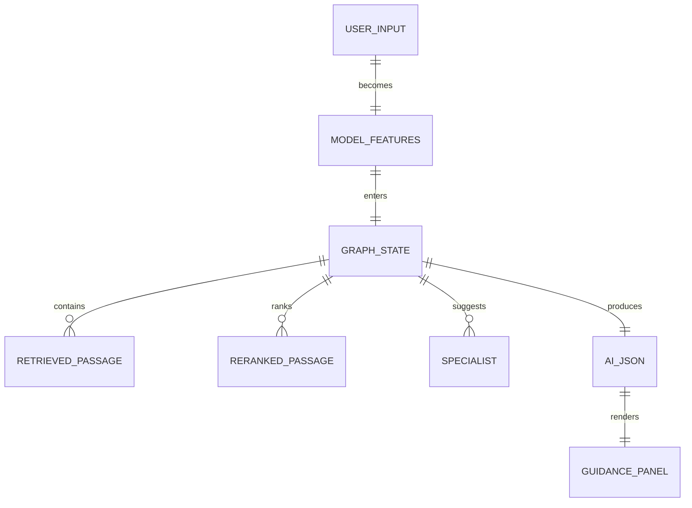

<p align="center">
    
</p>

<p align="center">
    <em>Predicting diabetes risk from lifestyle and clinical indicators for earlier intervention.</em>
</p>

<p align="center">
    <a href="https://diabetespreidictor.streamlit.app/"></a>
    
    
    
    
</p>

---

## ✨ Overview

This project predicts diabetes risk with a pretrained Logistic Regression model and then generates guideline-grounded AI guidance through a LangGraph pipeline.

- **Goal:** Early diabetes risk prediction for preventive action
- **Focus:** Minimize false negatives in healthcare screening
- **Current Runtime:** ML risk scoring + RAG + Gemini JSON guidance + source-name normalization

## 🧰 Tech Stack

| Area | Tools |
| :--- | :--- |
| Models | Logistic Regression (deployed), Random Forest/XGBoost/ANN (research phase) |
| ML / Data | Scikit-learn, Pandas, NumPy, Joblib |
| Visualization | Matplotlib, Seaborn |
| Retrieval + Reranking | FAISS, SentenceTransformers, CrossEncoder |
| LLM | Google Gemini (`google-genai`) |
| Orchestration | LangGraph |
| Deployment | Streamlit |
| Dataset | BRFSS 2015 (Kaggle) |

## 📊 Dataset

| Attribute | Value |
| :--- | :--- |
| Source | [BRFSS 2015 Diabetes Health Indicators (Kaggle)](https://www.kaggle.com/datasets/alexteboul/diabetes-health-indicators-dataset) |
| Records | ~253,680 |
| Features | 21 |
| Target | `Diabetes_binary` (0 = No, 1 = Yes) |

## 🚀 ML Decision

- Benchmarked models: Logistic Regression, Random Forest, XGBoost, ANN
- Selected final deployment model: **Logistic Regression**

## 📚 Medical Guidelines Sources

- World Health Organization (WHO).  
    *Classification of Diabetes Mellitus (2019).*  
    https://apps.who.int/iris/bitstream/handle/10665/325182/9789241515702-eng.pdf

- NICE Guideline NG28.  
    *Type 2 Diabetes in Adults: Management.*  
    https://www.nice.org.uk/guidance/ng28
    
## 🏗️ Prediction Flow




## 🔁 Reproducibility

The deployed app uses the shipped pretrained artifacts in [`models/`](./models):

- `lr_model.pkl`
- `scaler.pkl`
- `model_metadata.json`

Run the app:

```bash
pip install -r requirements.txt
./.venv/bin/streamlit run app/streamlit_app.py
```

Set API key for AI guidance (optional but recommended):

```bash
export GEMINI_API_KEY="your_key_here"
```

The app still returns ML predictions even if Gemini is unavailable (fallback JSON is used for the guidance panel).

## 🧠 Agentic Workflow



## 🗂️ Runtime State



## ✅ Current Runtime Notes

- Deployed risk model: Logistic Regression from `models/lr_model.pkl`
- Decision threshold: `0.58` (see `models/model_metadata.json`)
- RAG corpus currently restricted to two guideline PDFs in `data/guidelines/`
- Source labels shown in UI are normalized to: `WHO guideline` and `NICE guideline`

## 🔗 Quick Links

- Live app: [Diabetes Risk Predictor](https://diabetespreidictor.streamlit.app/)


## 👥 Team

- [Shubham Aggarwal](https://github.com/Shubham-60)
- [Atharva Sharma](https://github.com/alpha-sml)
- [Bhavya Punj](https://github.com/Rravya14)
