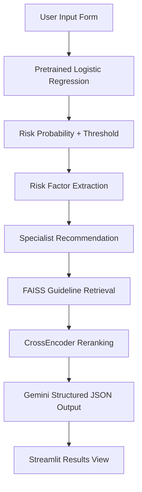
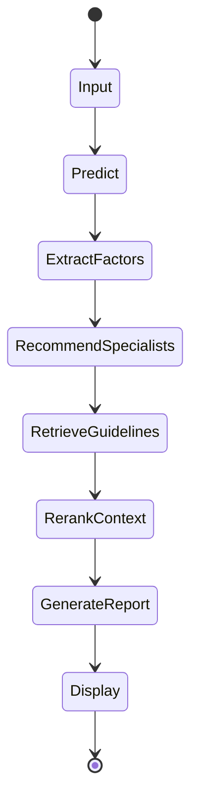
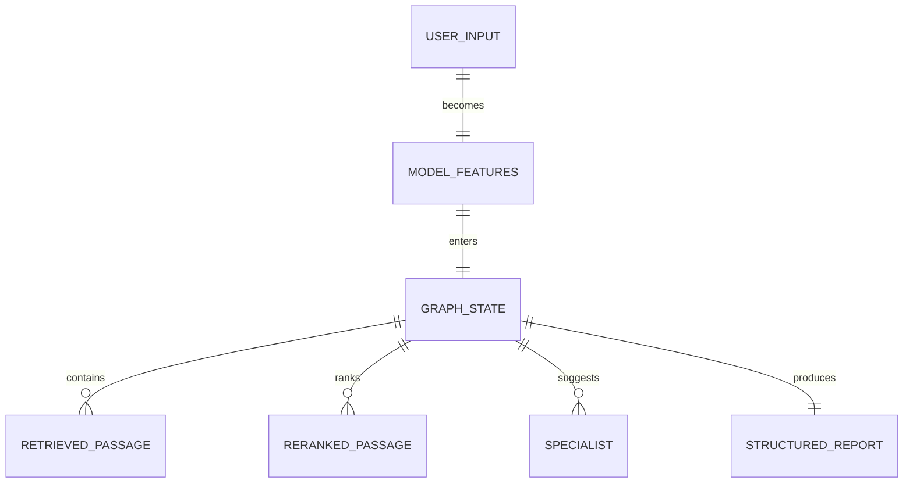

<p align="center">
    
</p>

<p align="center">
    <em>Predicting diabetes risk from lifestyle and clinical indicators for earlier intervention.</em>
</p>

<p align="center">
    <a href="https://diabetespreidictor.streamlit.app/"></a>
    
    
    
    
</p>

---

## ✨ Overview

This project builds and compares multiple machine learning models to predict diabetes risk, then deploys the best-performing model in an interactive Streamlit app.

- **Goal:** Early diabetes risk prediction for preventive action
- **Focus:** Minimize false negatives in healthcare screening
- **Scope:** Model comparison, tuning, threshold optimization, and deployment

## 🧰 Tech Stack

| Area | Tools |
| :--- | :--- |
| Models | Logistic Regression, Random Forest, XGBoost, ANN (MLPClassifier) |
| ML / Data | Scikit-learn, XGBoost, Imbalanced-learn, Pandas, NumPy |
| Visualization | Matplotlib, Seaborn |
| Orchestration | LangGraph |
| Deployment | Streamlit |
| Dataset | BRFSS 2015 (Kaggle) |

## 📊 Dataset

| Attribute | Value |
| :--- | :--- |
| Source | [BRFSS 2015 Diabetes Health Indicators (Kaggle)](https://www.kaggle.com/datasets/alexteboul/diabetes-health-indicators-dataset) |
| Records | ~253,680 |
| Features | 21 |
| Target | `Diabetes_binary` (0 = No, 1 = Yes) |

## 🏗️ Prediction Flow



> If Mermaid does not render in your Markdown viewer, open this README on GitHub.

## 🚀 Milestones

- Benchmarked models: Logistic Regression, Random Forest, XGBoost, ANN
- Selected final deployment model: **Logistic Regression**

## 🔁 Reproducibility

The deployed app uses the shipped pretrained artifacts in [`models/`](./models):

- `lr_model.pkl`
- `scaler.pkl`
- `model_metadata.json`

Run the app:

```bash
./.venv/bin/streamlit run app/streamlit_app.py
```

The Streamlit app executes a LangGraph workflow at runtime and relies on the pretrained logistic-regression artifacts already stored in the repo.

## 🧠 Agentic Workflow



## 🗂️ Runtime State



## 🔗 Quick Links

- Live app: [Diabetes Risk Predictor](https://diabetespreidictor.streamlit.app/)

## 👥 Team

- [Shubham Aggarwal](https://github.com/Shubham-60)
- [Atharva Sharma](https://github.com/alpha-sml)
- [Bhavya Punj](https://github.com/Rravya14)
